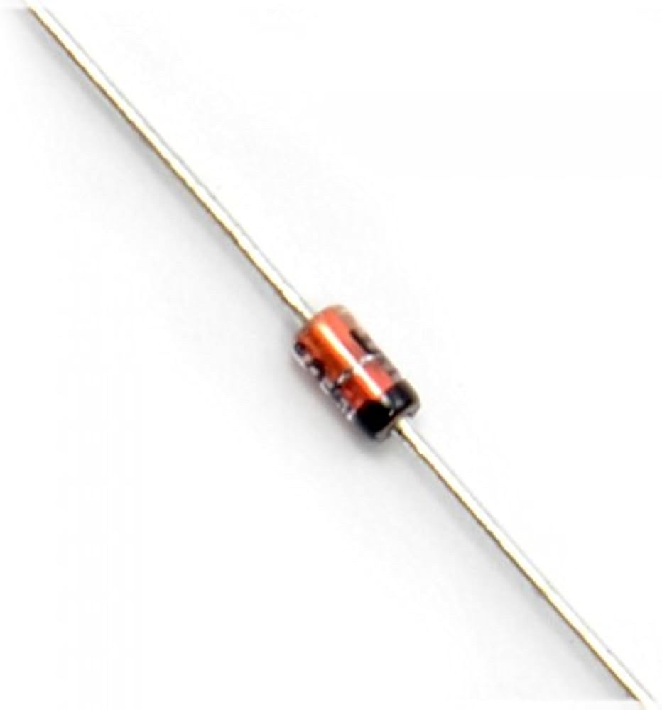

# 🚀 Build Your Dream Mechanical LED Keyboard with AVR! 🌟

Ever wanted to craft your own custom mechanical keyboard? Here's how I brought mine to life, step-by-step! 🛠️✨


---

### 🔧 **Project Highlights:**

- **Microcontroller Magic 🧠:**  
  Powered by the AVR64DU32 on a Curiosity Nano (cnano), this keyboard communicates seamlessly via USB-C using the Human Interface Device (HID) class. No soldering, no hassle—just plug and play!

  

- **Custom PCB in KiCad 💻:**  
  I designed a PCB to eliminate complex wiring, ensuring a sleek, professional layout. KiCad made it easy to customize my PCB, but managing library includes can be somewhat cumbersome.

    

- **Light Up the Keys! 🌈:**  
  Each key features a NeoPixel-compatible LED beneath, adding customizable lighting effects. LEDs are programmed directly alongside the keyboard firmware using MPLAB X IDE. Imagine the rainbow possibilities! 🌟 Due to a pcb schematic error (red circles), the ground and led data pin were swapped. Which is why lighting the leds will have to wait untill the arrival of a new pcb.

     
     

- **Case in Progress 🏗️:**  
  Next step: Designing the perfect case. Will it be 3D-printed or laser-cut? Stay tuned—this keyboard's journey isn’t over yet!

---

🎹 **DIY Tip:** If you're diving into mechanical keyboard projects, understanding matrix scanning and pcb tools like KiCad will open up endless customization!

Ready to create your own masterpiece? Let's type into the future! 🚀

## Component List
- Microcontroller: [AVR64DU32 curiosity nano](https://www.microchip.com/en-us/development-tool/ev59f82a)
- LEDs: [3.2x2.8mm sk6812 mini-E, reverse mount neopixel LEDs](https://www.aliexpress.com/item/1005005193716172.html)
- Diodes: [1N4148 DO-35 through hole diodes](https://www.aliexpress.com/item/1005006127068810.html)
- Switches: [JWICK V2 T1 Black Blue Tactile Switch 5pin RGB, Cherry MX](https://www.aliexpress.com/item/1005004226805283.html)
- Stabilizers for big switches: [PCB mounted Cherry MX stabilizers](https://es.aliexpress.com/item/1005004229140548.html)
- See-through Keycaps: [Polychroma V2 RGB Keycaps, Nordic ISO](https://www.maxgaming.no/no/keycaps/polychroma-v2-rgb-keycaps-131-pbt-polykarbonat-caps-nordic-iso)

## Milestones
1. 🖥️ [**Layout Creation:**](#layout-creation) Sketch the perfect keyboard design.
2. 🛠️ [**AVR Pin Setup:**](#avr-pin-setup) Map out pin connections and wiring.
3. 🔌 [**Component Selection:**](#component-selection) Choose the ideal switches, diodes, and LEDs.
4. 📐 [**PCB Design:**](#pcb-design) Craft your circuit board in KiCad and send it for manufacturing.
5. 🔧 [**Assembly:**](#assembly) Solder components onto the PCB.
6. 💻 [**Firmware Development:**](#firmware-development) Program the AVR for matrix scanning.
7. 🌈 **LED Integration:** Synchronize lighting with the firmware. (Suspended untill new pcb)
8. 🏗️ **Case Design:** Plan and create a custom case through 3D printing or laser cutting.
9. 📚 **Document Everything:** Share your journey and insights.


### Layout Creation
I used https://www.keyboard-layout-editor.com/ to create an initial layout for my keyboard. If you want to regenerate this design, go to the website and insert the raw json data from `keyboard_layout/raw_data.json`. 

 

When your design is ready, you will need the outline of the keyboard for the pcb design. Go to https://plate.keeb.io/ and paste the raw json data. Then you can then download the outline as an svg file.


### AVR Pin Setup
The important thing in this step is to map out how many pins your keyboard needs, and if your microcontroller can provide that. My keyboard needs 5 rows and 15 columns, hence 20 pins. Looking at pinout on the [cnano website](https://www.microchip.com/en-us/development-tool/ev59f82a), it has 24 port pins. Excluding the usb detect, LED control and degubber LED pin, we are left with 21 available pins, which is enough for our keyboard.


Reading the datasheet for the avrdu, it reveals that the usart0 signal can be routed to 4 possible transmission pins. We will use this signal to control the leds, and I chose alternative 3, PD4, as the LED_DATA pin.


### Component Selection
Check the [component list](#component-list) for handy links! Going with popular, widely-used components simplifies the PCB design, because pre-existing footprints save time and effort. That's why I selected the reliable Cherry MX switches alongside the 1N4148 DO-35 diodes. Some Cherry MX switches feature an opening for LEDs to shine through, perfect for illuminating your keyboard (see the marking on the picture below). I opted to solder everything manually, so I chose through-hole diodes and ensured the LEDs were hand-solderable.





Pro tip: Also, go for PCB-mounted stabilizers—they're far easier to install than plate mounted, and the PCB outline already accommodates them.


### PCB Design
Now the real fun begins! 🚀 Or maybe the challenge? 🛠️

#### Schematic
In KiCad, you’ll start by creating a clear and accurate schematic. This is the blueprint for your circuit, mapping out connections between components and ensuring everything fits together logically. Double-check those connections and that the schema matches the data sheets—it’s much easier to catch errors here than on a finished PCB!

In my schematics, I connected all my switches and diodes and assigned them rows and columns as described in the keyboard outline. Further, I designed a symbol for the avrdu cnano, with the pinout corresponding to the datasheet. I connected the rows and columns to available port pins, and the grounds, voltages and led pin to their corresponding pins.


#### PCB and 3D model
After completing the schematic, the next step is designing the PCB layout. In the pcb editor you can import the outline from `keyboard_layout/keyboard-outline.svg`, which lets you know where to place your components. 

Then you import all the components from the schematic and arrange the them according to your design outline. All the symbols from the schematics will be translated into their corresponding footprint, which can be a bit confunsing and I recommend watching a youtube video explaing in detail.


Now you need to route all the traces, which might be the most time consuming. The netlist, which is thin lines between your components, will show how everything should be connected.


You can double check that your design matches your vision by using the 3D viewer in kicad and assigning .step files to all your footprints. Here is the 3d model of the front and the back of my pcb:


Now your design is ready for production! I used the fabrication tool kit in KiCad, to create a .zip file with gerber files. Then I went to https://jlcpcb.com/, uploaded the file and sent it to production. 

Pro tip: If there are no footprints available for your microcontroller, you can use footprints for similar microcontrollers and manually add or remove holes in the footprint editor to match you preffered controller.


### Assembly
This is a very straight forward process where you solder your components on the pcb. Start with the diodes and leds and do the switches last. Here is the assembled keyboard with stabilizers:


### Firmware Development
The `full_keyboard_avrdu.X` project structure:
 - **usb**: For checking and maintaining the usb-c connection
 - **hardware**: Functions for scanning columns and activating rows
 - **main**: Handles keypresses and sends HID codes over usb
 - **keyboard**: Mapping of keypresses to HID codes
 - **led**: In progress, here you find general LED functions which I used in my summer project

#### Matrix Scanning
When a button is pressed, its column and its row are connected together. Since the active row is low, it will pull the column down, from high to low. The code sequentially activates each row and scans through all columns to detect keypresses. It detects both the change from high to low (key down) and from low to high (key up). This process is repeated continuously to monitor key presses.

```
void IterateColumns(void) // called every 1 ms
{  
    // Iterate columns
        // Check key down event
        // Check key up event
    }
    
    // Go to the next row
 
    return;
}
```

On each key change, press or release, a hid code is sent with either a press down or a press up event. 

```
void KeyPressHandler(uint8_t currentRow)
{
    DetectKeyChanges(currentRow);
    
    if (keyChanges)
    {
        if (keyDown)
        {
            KeyDownEvent();
        }
        else
        {
            KeyUpEvent();
        }
    }
}
```

For special characters, modifiers can be used (shift and ctrl). In my code I check if a keypress corresponds to a modifier and then send the modifier down or up event. 

### Case Design
In progress :)