<!-- Please do not change this logo with link -->

<a target="_blank" href="https://www.microchip.com/" id="top-of-page">
   <picture>
      <source media="(prefers-color-scheme: light)" srcset="images/mchp_logo_light.png" width="350">
      <source media="(prefers-color-scheme: dark)" srcset="images/mchp_logo_dark.png" width="350">
      
   </picture>
</a>

# Joystick Keyboard Using The USB HID Class
This example demonstrates how to use the USB Human Interface Device (HID) class on the AVR® DU microcontroller (MCU), paired with the AVR64DU32 Curiosity Nano Board, to interface with a joystick and a button functioning as a matrix keyboard.

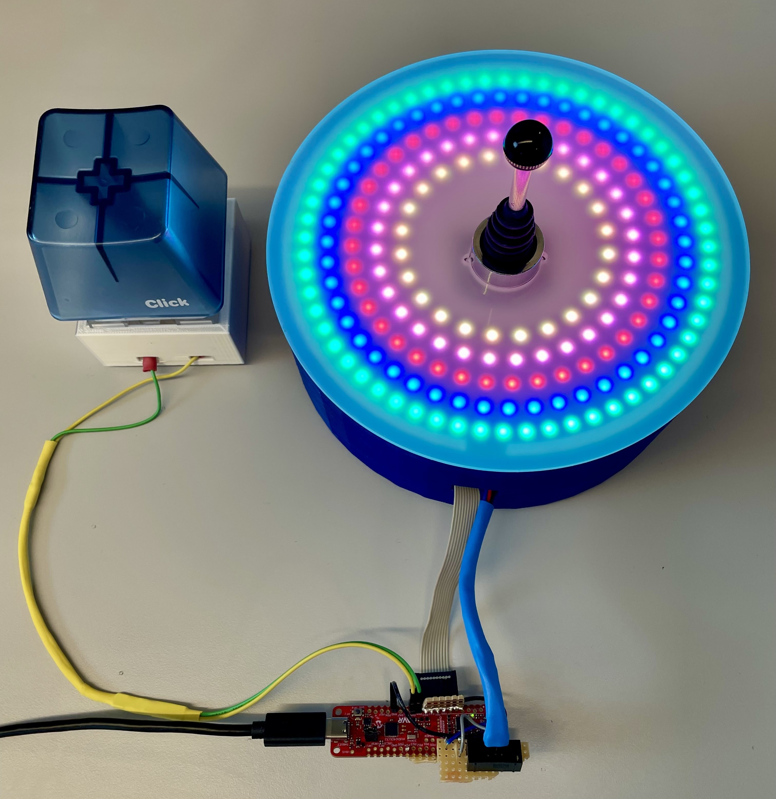

## Related Documentation
- [AVR® DU Family Product Page](https://www.microchip.com/en-us/products/microcontrollers-and-microprocessors/8-bit-mcus/avr-mcus/avr-du?utm_source=GitHub&utm_medium=TextLink&utm_campaign=MCU8_AVR-DU&utm_content=avr64du32-cnano-hid-keyboard-alternatives-mplab-mcc-github&utm_bu=MCU08)

### USB Specifications

- [USB 2.0 Specification](https://www.usb.org/document-library/usb-20-specification)
- [USB Human Interface Device (HID) Specification](https://www.usb.org/document-library/device-class-definition-hid-111)
- [Device Class Definition for HID 1.11](https://usb.org/document-library/hid-usage-tables-15)

## Software Used

- [MPLAB® X IDE 6.20](https://www.microchip.com/en-us/tools-resources/develop/mplab-x-ide?utm_source=GitHub&utm_medium=TextLink&utm_campaign=MCU8_AVR-DU&utm_content=avr64du32-cnano-hid-keyboard-alternatives-mplab-mcc-github&utm_bu=MCU08) or newer
- [MPLAB® XC8 Compiler 2.46](https://www.microchip.com/en-us/tools-resources/develop/mplab-xc-compilers?utm_source=GitHub&utm_medium=TextLink&utm_campaign=MCU8_AVR-DU&utm_content=avr64du32-cnano-hid-keyboard-alternatives-mplab-mcc-github&utm_bu=MCU08) or newer
- [MPLAB® Code Configurator (MCC) 5.5.1](https://www.microchip.com/en-us/tools-resources/configure/mplab-code-configurator?utm_source=GitHub&utm_medium=TextLink&utm_campaign=MCU8_AVR-DU&utm_content=avr64du32-cnano-hid-keyboard-alternatives-mplab-mcc-github&utm_bu=MCU08) plug-in 5.5.1 or newer

## Hardware Used

- [AVR64DU32 Curiosity Nano (EV59F82A)](https://www.microchip.com/en-us/development-tool/EV59F82A?utm_source=GitHub&utm_medium=TextLink&utm_campaign=MCU8_AVR-DU&utm_content=avr64du32-cnano-hid-keyboard-alternatives-mplab-mcc-github&utm_bu=MCU08)
- Joystick with four directions
- Push Button
- Five Neopixel Led Rings with 60, 48, 40, 32 and 24 LEDs.

## 3D Prints `.STL` Files
- [Joystick Case](3d-prints/Joystick_case.stl)
- [Joystick Lid](3d-prints/Joystick_outer_lid.stl)
- [Button Holder](3d-prints/button_holder.stl)
- [AVR Box](3d-prints/avr_box.stl)

## How It Works
The joystick supports four directions (up, down, left, right), while the button functions as a single-direction input (down). Each direction has two pins: one connected to ground (logic ``0``) and the other to a pull-up resistor, initially set to high (logic ``1``). After the [Physical Setup](#physical-setup) and the [MPLAB® Code Configurator Setup](#mcc-setup), pressing the joystick or button connects these pins, grounding them. That will trigger a Falling Edge interrupt on the pin that transitions from high to low, which then sends one or more HID signals to the PC over USB and starts an LED animation.

- **Joystick Up/Down**: Delete the current letter and send the previous/next letter in the alphabet, followed by the left arrow key
- **Joystick Left/Right**: Move to edit a previous letter/to write a new letter
- **Button Press**: Send the End and the Enter commands

## Setup

### Physical Setup

- Connect the joystick direction pins to the AVR64DU32 Curiosity Nano as follows:
    - LEFT: PA0
    - RIGHT: PA1
    - UP: PA2
    - DOWN: PA3
    - Connect the second direction pins to ground (GND)
- Push Button Connections:
    - Button pin 1: PA4
    - Button pin 2: PA5
- Neopixel LEDs connections:
    - Connect the GND on all the LED rings to GND on the AVR
    - Connect the 5V on all the rings to VBUS
    - Connect the Data In (DI) on largest ring to PD4
    - Connect the Data Out (DO) of the largest ring to the DI on the next ring, repeat for all rings

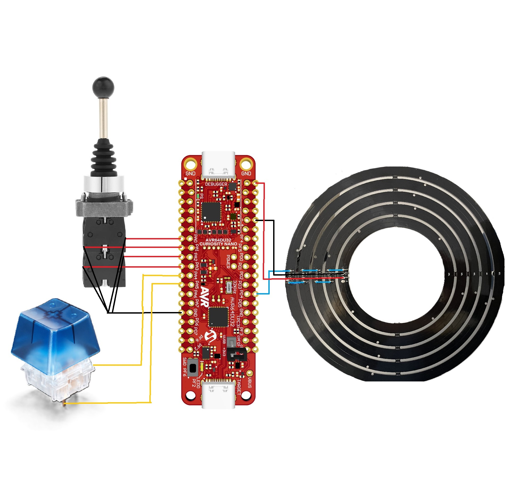

### MCC Setup

This section shows how to set up this example in MCC. An overview of the MCC setup is shown in the image below:

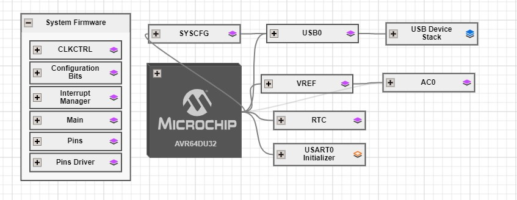

#### USB General Settings
The configuration is set so the AVR DU will identify as an HID device on the highest level. The Keyboard protocol is selected for the joystick keyboard.

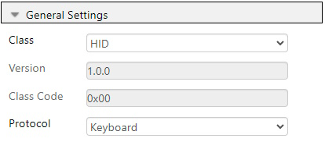

#### USB Device Descriptors
The Device Descriptors can be left as default.

#### USB Events And Callbacks
Enable the Start Of Frame callback. This will be called every 1 ms, and handle the USB connection.

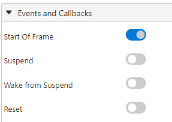

#### USB Interfaces
For this project, an HID interface is needed. It does not need any modification beyond being added.

#### USB HID Interface
The interface created in the last step does not need any modification, and is best left as default.

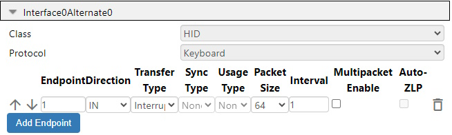

#### USB0 Power Settings
By default, the AVR runs on 3.3V. However, if 5V is preferred, the USB voltage regulator must be enabled.

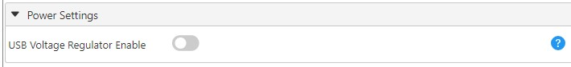

### Device Clock Setup
The CLKCTRL module is located in the System Firmware drop-down menu. This example is configured to run on 24 MHz. The minimum oscillator frequency available for USB on the AVR DU is 12 MHz.

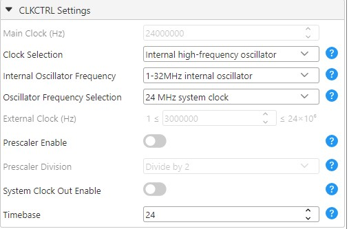

### USB Voltage Detection Setup
To ensure that the USB peripheral only tries to attach to the bus when the Curiosity Nano is connected to the PC, the Analog Comparator will periodically check if the voltage is within the acceptable range for VBUS.

#### Voltage Reference Setup
In the VREF peripheral, the Voltage Reference is set to 2.048V.

#### Analog Comparator Setup (AC)

##### Analog Comparator Hardware Settings
The Analog Comparator must be enabled by toggling Enable under Hardware Settings.

##### Analog Comparator MUX Control Settings
To measure the correct values, the positive input must be connected to Analog Input Pin 4, while the negative input is set to the Digital-to-Analog Converter (DAC) Reference.

##### Analog Comparator DAC Reference Settings
The DACREF register must be set to a value that can detect the correct voltage level at minimum 0.4V. The target voltage can be set directly in the Requested Voltage (V) input under Hardware Settings. Refer to the [AVR64DU32 Curiosity Nano User Guide](https://ww1.microchip.com/downloads/aemDocuments/documents/MCU08/ProductDocuments/UserGuides/AVR64DU32-Curiosity-Nano-UserGuide-DS50003671.pdf) to find the values for the voltage divider on the PC3 pin.

#### Real-Time Counter Setup

##### RTC Period Settings
In the Hardware settings, enable the RTC. Note down the RTC Clock Source Selection (32768 Hz /32 = 1024 Hz), as it will impact the Period Selection value needed for the Periodic Interrupt Timer.

##### RTC Periodic Interrupt Control Settings
The Periodic Interrupt Timer (PIT) is enabled for this example, and the period selection is set to RTC Clock Cycles 1024, to get one interrupt per second. This value must be changed according to the clock source selection.

##### RTC Periodic Interrupt Interrupt Control Settings
The PIT Interrupt Flag is also enabled to allow for an interrupt routine.

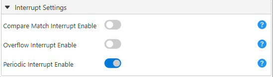

#### Interrupt Manager Setup
Enable global interrupts in the Interrupt Manager under System Firmware to recognize the USB and RTC interrupts.

### USART0 Initializer
The USART0 is used to control the LEDs. It is configured as a transmitter in Serial Peripheral Interface (SPI) mode and sends an oscillating signal to control the LEDS. The transmitter signal is by default routed to PA0. As this pin will be used by the joystick, the transmitter signal is rerouted to PD4 in the code. See the [AVR64DU32 data sheet](https://ww1.microchip.com/downloads/aemDocuments/documents/MCU08/ProductDocuments/DataSheets/AVR64DU-28-32-Prelim-DataSheet-DS40002548.pdf) for more alternative USART ports.

#### USART Baud Rate
Set the Baud Rate to 128.

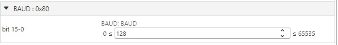

#### USART CTRLB
Enable the Transmitter.

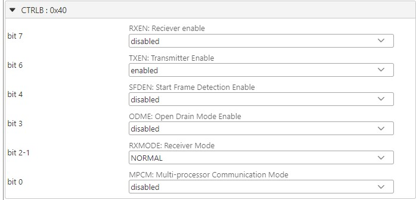

#### USART CTRLC
Set the Communication Mode to MSPI and disable the Clock Phase for SPI Host Mode. This will automatically select the 5BIT Character Size, if not, select it manually.

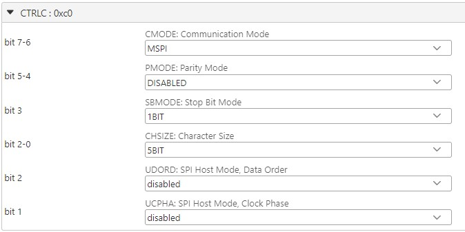

### Device Pin-out Setup
Eight pins are used for this example. They can be added in the **Pin Grid View** and configured under *System Firmware->Pins*.
Remember to rename the pins to their custom names.
- VBUS on PC3 is automatically set as analog input, with "Digital Input Buffer disabled"
- Set the joystick directions and BUTTON, which are on Port A pin 0 to 4, to input with "Sense Falling Edge"
    - Enable Pull-Ups to ensure that no pins are floating
    - Enable Start High, as the both the joystick and Button are active-low
- Set BUTTON_GND on PA5 to output with "Interrupt disabled but input buffer enabled"
- Set PD4 as output, which is the LED_DATA_PIN used to control the LEDs. Configure the pin with "Interrupt disabled but input buffer enabled"
    - Enable Start High
    - Enable Inverted Input/Output

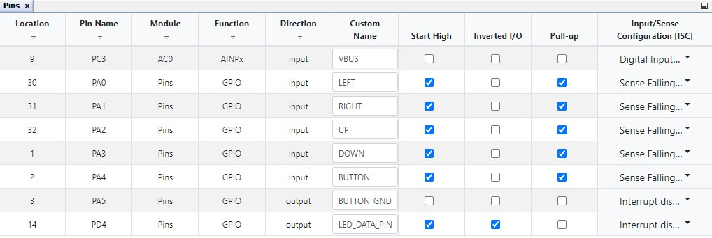

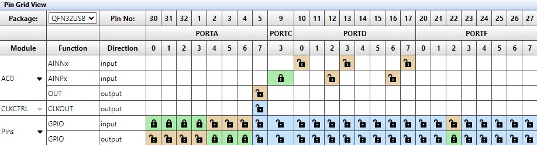

## Operation

This example can be tested by following these steps:

1. Generate the MCC code and replace the contents of the generated ``main.c`` with the contents from the ``main.c`` in the source code.
2. In the project directory (.X), insert the ``leds`` and the ``joystick_interrupt`` files from the source code.
3. Inside MPLAB, right click Source Files and Header Files and choose Add Existing Item to respectively add the ``.c`` and ``.h`` source files.

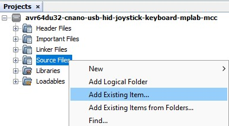

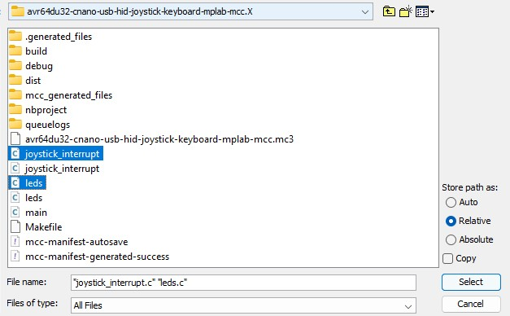

 4. Connect the Debugger plug on the Curiosity Nano Board (cnano) to the PC and upload the C code.
 5. Connect the PC to the Target plug to start the USB communication.
 6. Open any program that allows for text input, move the joystick and press the button.

## Summary

This example has demonstrated how the USB HID class can be used on an AVR DU to interface a joystick and button keyboard using the Curiosity Nano kit.
